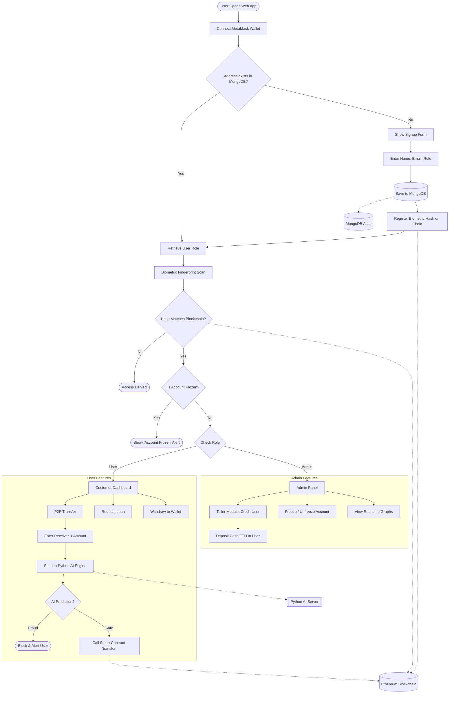

# 🏦 BankSEC - Secure AI-Powered Decentralized Banking

> **A Hybrid Fintech Platform combining Blockchain Security, Web2 Flexibility, and AI Fraud Prevention.**


---

## 📖 Overview
**BankSEC** is a robust banking prototype designed to solve the security flaws of traditional and decentralized finance. It uses a **"Teller Model"** where Admins control liquidity, while customers enjoy secure, private banking features.

The system integrates an **Isolation Forest AI Model** that acts as a firewall, analyzing every P2P transfer request. If the AI detects an anomaly (e.g., unusual amount or rapid frequency), it blocks the transaction *before* it reaches the Blockchain.

### 🌟 Key Features
* **🔐 Decentralized Identity (DID):** Biometric hashes stored on-chain for password-less, secure login.
* **🤖 AI Security Layer:** Python-based AI engine intercepts and blocks fraudulent transactions in real-time.
* **💰 Smart Banking:**
    * **P2P Transfers:** Instant, secure money transfers between users.
    * **Loans:** Automated loan issuance based on smart contract liquidity.
    * **Withdrawals:** Seamless movement of funds from Bank Balance to Web3 Wallet.
* **👮 Admin Teller Panel:**
    * **Liquidity Management:** Admin deposits cash (ETH) to credit user accounts.
    * **Freeze/Unfreeze:** Emergency controls to lock suspicious accounts.
    * **Live Analytics:** Real-time graphs showing bank liquidity and loan risk.

---

## 🏗️ System Architecture

The following diagram illustrates the hybrid flow between the React Frontend, Python AI, MongoDB Database, and Ethereum Blockchain.




## 🛠️ Tech Stack

| Component | Technology | Role |
| :--- | :--- | :--- |
| **Frontend** | React.js + Vite | User Interface & State Management |
| **Smart Contract** | Solidity + Hardhat | Core Banking Logic & Ledger |
| **Backend** | Node.js + Express | User Authentication & Role Management |
| **Database** | MongoDB Atlas | Storing User Profiles & Metadata |
| **AI Engine** | Python + Scikit-Learn | Real-time Fraud/Anomaly Detection |
| **Blockchain** | Localhost (Hardhat Node) | Ethereum Network Simulation |

---

## ⚙️ Installation & Setup

To run this project, you must run **4 separate terminals** simultaneously.

### 1. Setup Blockchain (Terminal 1)
Start the local Ethereum network.
```bash
cd BankSEC-Core
npm install
npx hardhat node
```
> Keep this terminal running to maintain the network.

## 2. Deploy Contracts (Terminal 2)
Deploy the banking smart contract.

```bash
cd BankSEC-Core
npx hardhat run scripts/deploy.js --network localhost
```

* **Note:** Copy the `Contract Address` and update it in `BankSEC-UI/src/App.jsx`.
* **Note:** Copy `BankSEC.json` from `artifacts/` to `BankSEC-UI/src/abis/`.

### 3. Start Backend & AI (Terminal 3)
**Tab A: Node.js Backend**
```bash
cd BankSEC-Backend
npm install
node server.js
```
**Tab B: Python AI Server**
```bash
cd BankSEC-AI
python -m venv venv
# Windows: venv\Scripts\activate
# Mac/Linux: source venv/bin/activate
pip install -r requirements.txt
python app.py
```
###4. Start Frontend (Terminal 4)
**Launch the user interface.**

```bash
cd BankSEC-UI
npm install
npm run dev
```
## 📖 Usage Guide

1.  **Admin Login:**
    * Connect with **Account #1** (Deployer).
    * Sign up as "Admin".
    * Use the **Teller Module** to deposit 10 ETH into a User's account.
2.  **User Login:**
    * Connect with **Account #2** (Customer).
    * Sign up as "User".
    * Check dashboard; you should see the 10 ETH balance.
3.  **Test Security:**
    * Try sending **2 ETH** (AI permits it).
    * Try sending **100 ETH** (AI blocks it as fraud).

---

## 📄 License
This project is open-source.

<!-- **Developed by [Your Name]** -->